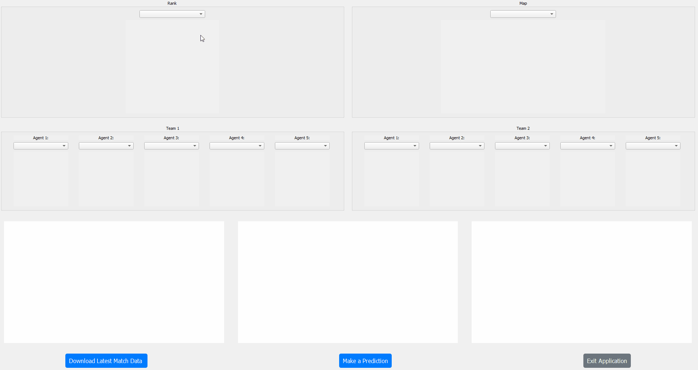

<br />
<div align="center">
  <a href="https://github.com/kleinaitis/valorant-match-predictor">
    
  </a>
  <p align="center">
The Valorant Match Predictor employs cutting-edge machine learning techniques to forecast match outcomes in Valorant, tailored to user-selected parameters: map, rank, and team composition. This Python application leverages a vast dataset sourced from hundreds of thousands of actual Valorant games meticulously scraped from tracker.gg. Its core mission is to deliver precise predictions about match winners and losers, serving as an indispensable tool for players of all skill levels to make well-informed decisions and elevate their gameplay strategies.    <br />
    <a href="https://github.com/kleinaitis/valorant-match-predictor/issues">Report a Bug</a>
    ·
    <a href="https://github.com/kleinaitis/valorant-match-predictor/issues">Request a Feature</a>
  </p>
</div>
<div align="center">

</div>

<!-- GETTING STARTED -->
## Getting Started
Getting started with the Valorant Match Predictor is a breeze. This application is conveniently packaged as an executable using PyInstaller, making it incredibly easy to run on your machine. Follow these simple steps to begin predicting Valorant match outcomes:
### Installation

1. **Clone the Repository**: First, clone the repository to your local machine using the following command:
   ```sh
   git clone https://github.com/kleinaitis/valorant-match-predictor.git
   ```
2. **Run the Executable**: Inside the cloned repository, locate the main.exe file in the ```valorant-match-predictor/dist/main/``` directory. You can run it by double-clicking on it or executing it from the command line.
<p align="right">(<a href="#readme-top">back to top</a>)</p>

<!-- CONTRIBUTING -->
## Get Involved
I truly appreciate your input, feedback, and suggestions in contributing to the improvement of the Valorant Match Predictor.
Here's how to contribute:

1. **Fork the Project**
2. **Create a Feature Branch**: `git checkout -b feature/AmazingFeature`
3. **Commit Your Changes**: `git commit -m 'Add some AmazingFeature'`
4. **Push to Your Branch**: `git push origin feature/AmazingFeature`
5. **Open a Pull Request**

### Share Your Ideas

Don't hesitate to share your ideas or report issues. If you have suggestions for improvements, open an issue with the "enhancement" tag.

### Show Your Support

If you find this project valuable, please consider giving it a star. Your support is greatly appreciated.
Thank you for considering contributing and making this project even better!

<p align="right">(<a href="#readme-top">back to top</a>)</p>